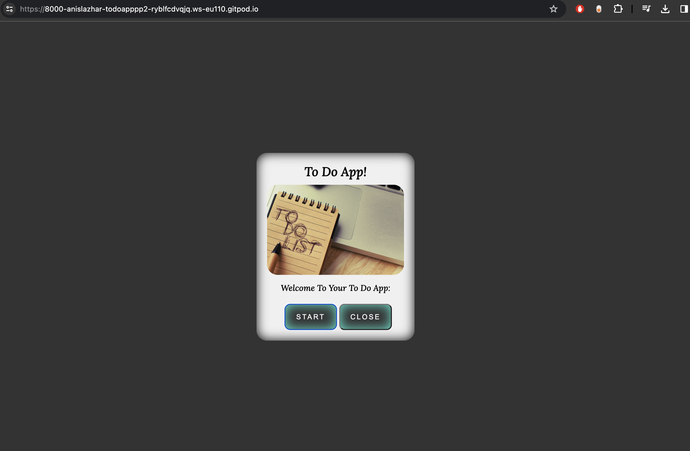

# To-Do App

The to-do App is live, please [Click Here](https://anislazhar.github.io/ToDoApp-pp2/) to check It.

## Table of Contents

- [UX](#ux)
  - [Site/App Purpose](#siteapp-purpose)
  - [Site/App Goal](#siteapp-goal)
  - [Audience](#audience)
  - [Communication](#communication)
  - [Current User Goals](#current-user-goals)
  - [New User Goals](#new-user-goals)
- [Design](#design)
  - [Colour Scheme](#colour-scheme)
  - [Typography](#typography)
  - [Imagery](#imagery)
- [Features](#features)
  - [Existing Features](#existing-features)
    - [Start page](#start-page)
    - [Main App page](#main-app-page)
    - [See You Later page](#see-you-later-page)
    - [404 page](#404-page)
- [Testing](#testing)
  - [Manual Testing](#manual-testing)
  - [Validator Testing](#validator-testing)
  - [Unfixed Bugs](#unfixed-bugs)
- [Technologies Used](#technologies-used)
  - [Main Languages Used](#main-languages-used)
  - [Frameworks, Libraries & Programs Used](#frameworks-libraries--programs-used)
- [Deployment](#deployment)
  - [How to deploy](#how-to-deploy)
  - [How to clone](#how-to-clone)
- [Credits](#credits)
  - [Media](#media)
  - [Code](#code)
  - [Acknowledgements](#acknowledgements)

## UX

### Site/App Purpose

This is a simple to-do list application designed to help users keep track of tasks, manage daily progress on projects, and remember pending tasks.

### Site/App Goal

The goal is to assist users in staying organized and on top of their deadlines, replacing traditional pen-and-paper to-do lists.

### Audience

The application is for anyone who wants to stay organized and on top of their tasks, including students, professionals, and individuals seeking productivity tools.

### Communication

The application features a clear and simple design, guiding users through adding tasks and monitoring progress. Local storage ensures tasks are retained even if the app is closed.

### Current User Goals

- Stay organized and productive.
- Reduce stress and anxiety by tracking tasks.
- Have a clear picture of tasks.
- Feel more in control of workload.

### New User Goals

- Learn to use the app effectively.
- Discover features for motivation and focus.
- Explore customization options.

## Design

### Colour Scheme

The color palette provides contrast without overwhelming, featuring primarily dark, calm colors to avoid eye strain in dark environments.

### Typography

The font "Lora" is chosen for readability, with "sans-serif" as an alternative.

### Imagery

The start interface image conveys organization and calmness, encouraging users to approach tasks with focus.

## Features

### Existing Features

#### Start page

- Simple interface with dark background.
- Start and close buttons for user choice.
  

#### Main App page

- Input field for adding tasks.
- List of added tasks with delete option.
- Clear all button.
- Exit button redirects to "See You Later" page.
- Local storage retains tasks.
  

#### See You Later page

- Turquoise smiley face design.
- Encouraging text for returning later.
  

#### 404 page

- Simple page with link to start page.
- Clear error message.
  

## Testing

### Manual Testing

- Thorough testing conducted on all features.
- Ensured expected outcomes for user processes.

### Validator Testing

- HTML (By using [W3C validator](https://validator.w3.org/))

  - Result for index.html

    

  - Result for todolistpage.html

    

  - Result for seeyoulater.html

    

- CSS (By using [Jigsaw validator](https://jigsaw.w3.org/css-validator/))

  - Result for style.css

    

- JavaScript (By using [jshint](https://jshint.com/))

  - Result for start.js

    

  - Result for main.js

    

  - Result for end.js

    

- Lighthouse Testing (By using the Lighthouse feature of Google Chrome's Developer Tools)

  - Result for index.html

    

  - Result for todolistpage.html

    

  - Result for seeyoulater.html

    

- Accessibilty (By using [WAVE](https://wave.webaim.org/))

  - There are No errors or contrast errors were returned, there are only two alerts displayed in all App pages as per image below:

    

### Unfixed Bugs

- Console errors in Chrome and Edge.
- Canvas 2D errors in all browsers.
  

- Second Unfixed Bug: I am experiencing an error related to Canvas 2D in all app pages on Chrome and MS-Edge browsers console. The error shows inside the process of Lighthouse and disappears after that.

  

## Technologies Used

### Main Languages Used

- HTML5
- CSS3
- JavaScript

### Frameworks, Libraries & Programs Used

- Google Fonts
- Coolors
- VS-Code
- GitHub
- Balsamiq
- Favicon.io

## Deployment

### How to deploy

- Deployed to GitHub Pages.
- Source branch selected in repository settings.
- The live link can be found Here [to-do List App](https://anislazhar.github.io/ToDoApp-pp2/) .

### How to clone

- Copy repository link.
- Go to the following repository on GitHub: https://github.com/Anislazhar/ToDoApp-pp2.
- Clone to local machine in VS-Code terminal.

## Credits

### Media

- Start interface image sourced from Pinterest.

### Code

- Various online resources consulted.
- Stack Overflow used for troubleshooting.
- Slack channels for community support.

### Acknowledgements

- Thanks to mentor Martina for feedback.

---